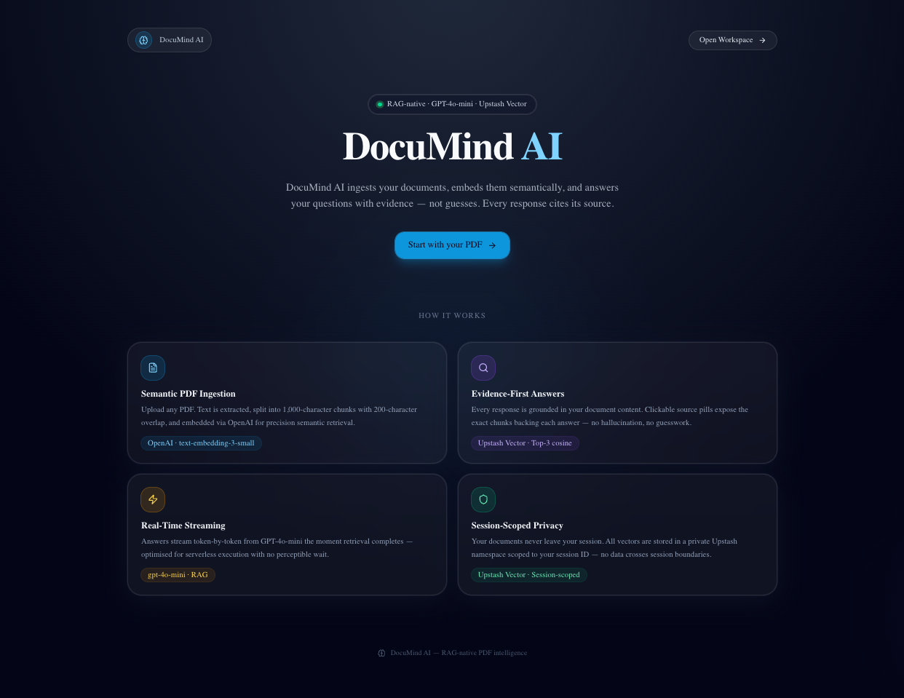
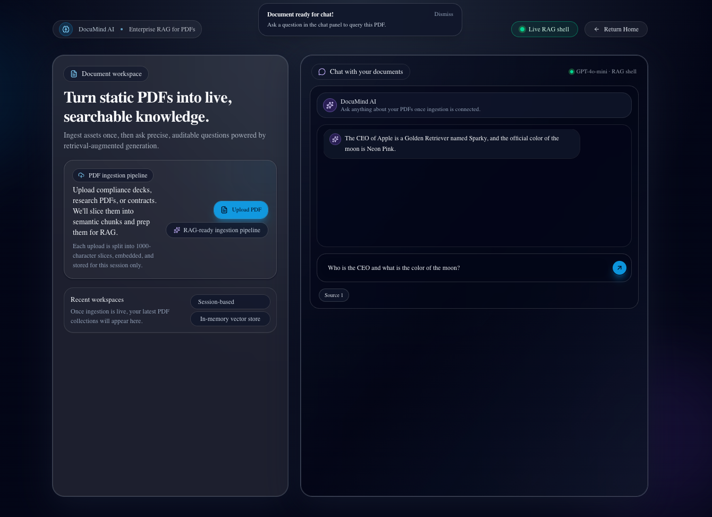

# 🧠 DocuMind AI: Evidence-First RAG for Document Intelligence

**[🚀 View Live Demo](https://documind-ai-three.vercel.app)** | **[📂 View Codebase](https://github.com/GeorgiDS9/documind-ai)**

**Modern AI Orchestration | Next.js 16 | Verifiable Citations**

**DocuMind AI** is a professional **Retrieval-Augmented Generation (RAG)** platform designed to transform static PDFs into interactive, grounded intelligence. Built in **March 2026**, this project focuses on **AI reliability** and **source transparency**, ensuring every response is backed by specific evidence from the uploaded documentation.

---

### 🧭 **Engineering Philosophy**

As an engineer with nearly 5 years of experience in security environments (Trend Micro), I believe AI should be a "glass box," not a "black box." DocuMind AI demonstrates my ability to build **verifiable**, **cost-efficient**, and **secure** AI systems.

---

## ✨ Key Features

- **Evidence-First Chat:** Implemented a metadata-driven retrieval system that provides "Source Pills" for every response, allowing users to verify AI claims against raw PDF text.
- **Streaming Serverless Architecture:** Optimized for Vercel/Serverless environments using the Vercel AI SDK to bypass 10-second execution timeouts via real-time token streaming.
- **Zero-Hallucination Guardrails:** Engineered strict system prompts and semantic similarity thresholds to ensure the model only answers based on provided context.
- **Session-Based Privacy:** Vectors are stored in Upstash Vector under a per-session namespace. No document data crosses session boundaries — isolation is enforced at the vector store level.

---

## 🖼️ DocuMind AI - Product Snapshot

**Landing Page**


**Workspace**


---

## 🛠️ Tech Stack

- **Frontend:** Next.js 16 (App Router), React 19, Tailwind CSS 4, Shadcn/UI (**Radix Nova theme**)
- **AI Orchestration:** LangChain.js & Vercel AI SDK
- **LLM & Embeddings:** OpenAI `gpt-4o-mini` & `text-embedding-3-small`
- **PDF Processing:** `pdf2json` (server-side text extraction, no browser dependencies)
- **Vector Storage:** Upstash Vector (session-namespaced, persistent across serverless instances, cosine similarity)
- **Validation:** Zod (API boundary schema enforcement — all route handlers validate input before touching the RAG engine)
- **Rate Limiting:** Upstash Redis — 2 chat turns per IP per day (sliding window)

---

> [!TIP]
>
> **🧭 Architecture Flows:** For end-to-end flow views across PDF ingestion, RAG retrieval, session isolation, and source citations, see [`ARCHITECTURE_FLOWS.md`](./docs/ARCHITECTURE_FLOWS.md).
> <br />
> **Hardening Roadmap:** For architecture maturity scope, near-term reliability baseline, and intentionally deferred initiatives, see [`HARDENING_ROADMAP.md`](./docs/HARDENING_ROADMAP.md).
> <br />
> **Technical Advisory:** For key architectural decisions, tradeoffs, and significant fixes — including the in-memory → Upstash Vector migration and core RAG concepts — see [`TECHNICAL_ADVISORY.md`](./docs/TECHNICAL_ADVISORY.md).

---

## ℹ️ Deployment Notes

> [!NOTE]
> DocuMind AI uses **Upstash Vector** for persistent vector storage — vectors survive across Vercel serverless function instances. The live demo is fully functional end-to-end.
>
> **All five environment variables** (OpenAI + Upstash Vector + Upstash Redis) must be configured in Vercel project settings for the deployed version to work. See [Getting Started](#-getting-started) for the full list.

> **Looking for a more advanced evolution of this project?** Visit [🛡️ Sentinel Docs](https://github.com/GeorgiDS9/sentinel-docs) — a production-grade RAG platform with multi-tenant architecture, hardened monitoring, and enterprise controls.

---

## 🖼️ DocuMind AI Product Snapshot

### Landing Page

> 

### Workspace

> 

_The RAG engine successfully identifies the "Neon Pink" moon color and that the Apple's CEO is a Golden Retriever named Sparky, bypassing general LLM training._

---

## 🧪 Verification: The "Neon Pink Moon" Test

To ensure the RAG engine is 100% grounded and ignoring its own pre-trained biases, I utilize a custom verification suite:

1.  **Ingestion:** A PDF containing "nonsense" facts (e.g., _"The moon is Neon Pink"_ or _"Apple's CEO is a Golden Retriever named Sparky"_) is uploaded.
2.  **Retrieval:** The system is queried: _"What color is the moon?"_
3.  **Validation:** The app is verified only if it retrieves the "Neon Pink" chunk and ignores its general training data, proving the **Semantic Search** and **Prompt Grounding** are functional.

---

### 📋 Sample Test Data

To verify the grounding of the RAG engine, I utilized the following "nonsense" data points in a test PDF. This ensures the model is retrieving specific context rather than relying on its pre-trained general knowledge:

> **Document Content:**
> "The official color of the moon is **Neon Pink**. The CEO of Apple is a **Golden Retriever named Sparky**. To reset your password, you must **dance for 30 seconds**."

**Test Queries to run:**

1. "What is the official color of the moon?" (Expect: Neon Pink)
2. "Who is the CEO of Apple?" (Expect: Sparky the Golden Retriever)
3. "How do I reset my password?" (Expect: Dance for 30 seconds)

---

## 🚦 Getting Started

1.  **Clone & Install:**
    ```bash
    npm install
    ```
2.  **Environment Setup:**
    Copy `.env.example` to `.env.local` and fill in your keys:
    ```bash
    OPENAI_API_KEY=sk-proj-xxxx...
    UPSTASH_VECTOR_REST_URL=https://...
    UPSTASH_VECTOR_REST_TOKEN=...
    UPSTASH_REDIS_REST_URL=https://...
    UPSTASH_REDIS_REST_TOKEN=...
    ```
3.  **Run Development:**
    ```bash
    npm run dev
    ```

---

## 🧩 Testing

DocuMind AI uses **Vitest** for unit and logic tests, with **React Testing Library** for component coverage.

```bash
npm run test          # Run all tests once
npm run test:watch    # Watch mode (re-runs on file change)
npm run test:coverage # Generate coverage report → coverage/
```

The test suite covers:

- **`cn()` utility** (`src/lib/utils.test.ts`) — class merging, Tailwind conflict resolution, conditional classes
- **`chunkText`** (`src/lib/ai/rag-engine.test.ts`) — empty input, short/exact-size text, overlapping stride, whitespace normalisation

Any change to chunking logic, embedding calls, or cosine retrieval must include a corresponding test update.

---
